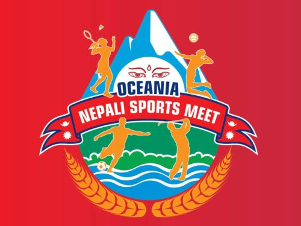

+++
title = "Our Story"
date = 2018-12-31
weight = 2
+++

Oceania Nepali Sports Meet (ONSM) is a not-for-profit organisation registered under the NSW Fair Trading and the
Australian Securities and Investment Commission (ASIC). The ONSM organises biennial sporting events, called the
Oceania Nepali Sports Meet, featuring a range of sports competitions drawing hundreds of athletes from Australia
and New Zealand and the other countries in the Oceania region.

Australian states and territories, New Zealand and the other countries in the Oceania region constitute jurisdictional
units of the ONSM, hence they are collectively referred to as ‘jurisdiction’ or ‘state/country’.

The main objective is to define and articulate the structure and management of the ONSM
including roles and responsibilities of the host and participating state / country to enable the ONSM to function
more effectively at the national, state or Oceania level. This is envisaged to ensure that the objectives and goals of
the ONSM are achieved in partnership with the local organisations.

The intent is to be transparent and inclusive. Hence all sport lovers and young sporting talents have the
opportunity to get involved, volunteer and gain exposure to the leadership and management of the ONSM.
Proponents of the ONSM who have been involved in the last four ONSM events will play an important role in
strategic shaping and mentoring of new leadership for the management of the ONSM moving forward in to the
future.
