+++
title = "1st NISM 2013"
date = 2013-12-31
+++

**By Jabin Shrestha - 02 January 2014**

Sydney, NSW – Nepalese Recreational Club **(NRC)** would like to announce that first interstate sports
tournament held in Sydney from 27 – 29 of December 2013 has been completed with great success.
Competitions were held in Golf, Tennis, Badminton and Table Tennis.

##### Golf
The tournament kicked – off on the early morning of Friday 27, December 2013 at Chatswood
Golf Club. A total of 15 players with different levels of Handicap from VIC and NSW participated. This
tournament was coordinated by Mr Jog Limbu (VIC) and Mr Deepak Khadka (NSW).

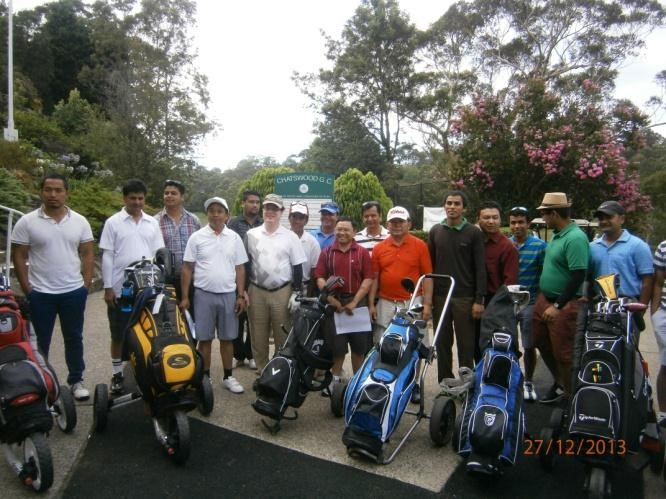
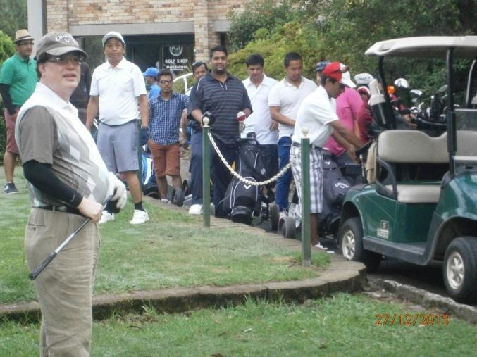

##### Tennis
The tournament was held across two days Friday 27 and Saturday 28 December 2013 at
North Ryde RSL Youth Club and Strathfield Sports Club Tennis courts. A total of 16 players from NT,
QLD, VIC and NSW participated. This tournament was coordinated by Mr Bishnu Hamal and Mr Dil
Kumar Bharti.

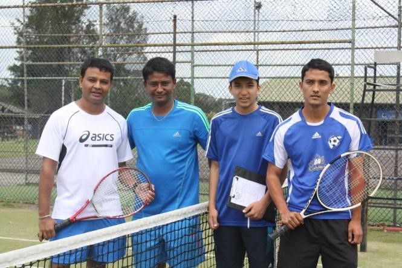
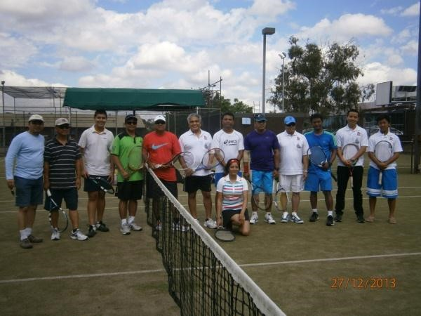
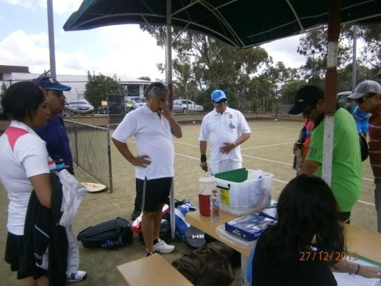
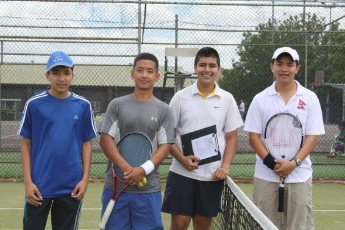

##### Badminton
This competition started on Friday 27 December 2013 at North Ryde RSL Youth Club
Badminton courts and concluded in Sport Centre, Sydney Olympic Park on Sunday 29 December
2013. Over 60 players from ACT, NSW, QLD and VIC participated in Men’s single and Doubles, Ladies
single and Doubles and Mix doubles categories. This Tournament was coordinated by Mr Hemant
Bhatta, Mr Sanju Roka and Mr Jabin Shrestha.

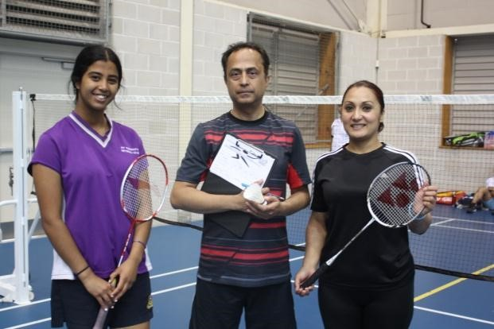
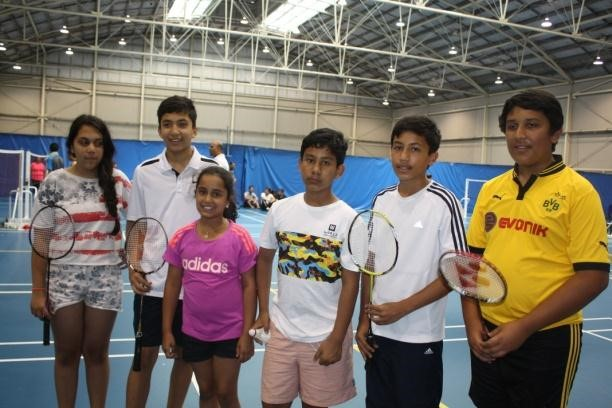
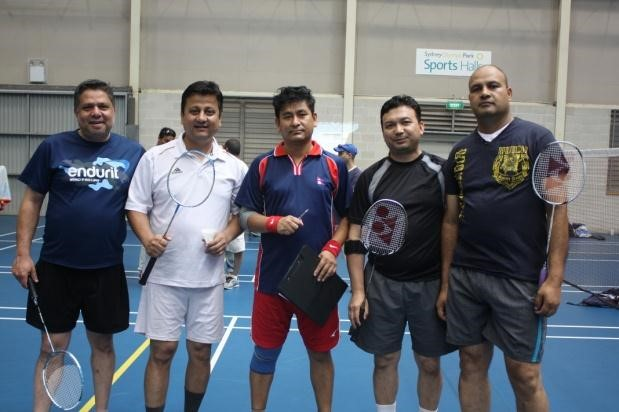
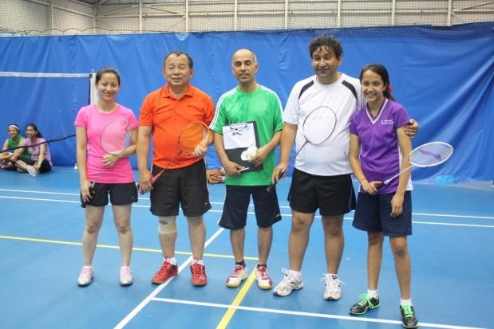

##### Table Tennis
This tournament was held in Sports Centre, Sydney Olympic Park on Sat 28 and Sun 29
December 2013. Over 45 players from VIC, ACT, QLD and NSW participated in Men’s Single and
Doubles and Ladies single and Doubles and Mix Doubles. This competition was coordinated by Mr
Kuldeep Pradhan.

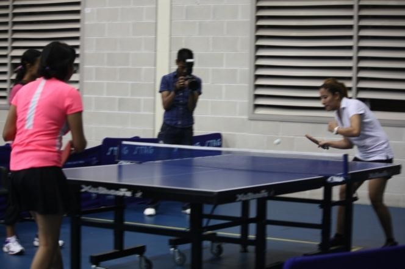
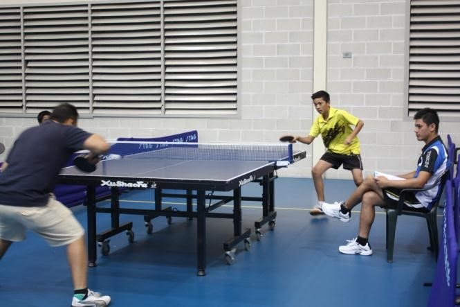
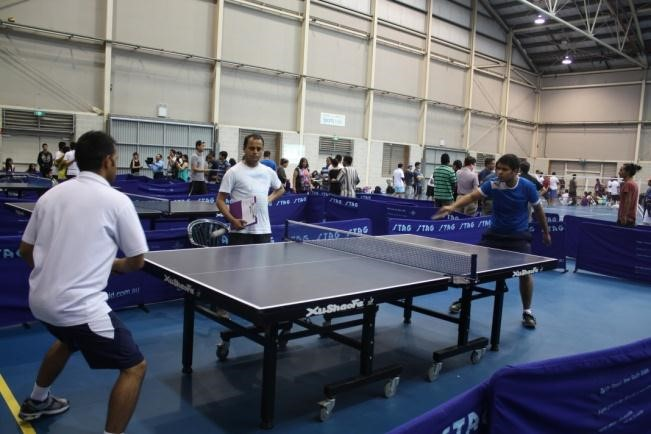
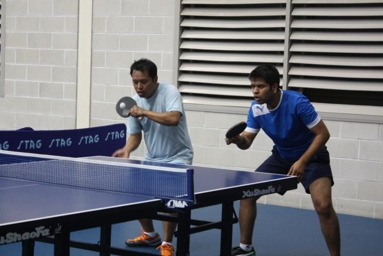

H.E. Rudra Kumar Nepal, Ambassador of Nepal to Australia, Mr Deepak Khadka, Honorary Council
General of Nepal to NSW, Sponsors of this tournament, Media personnel, Community leaders and
Nepalese living in Australia came in big number to witness this historic event.

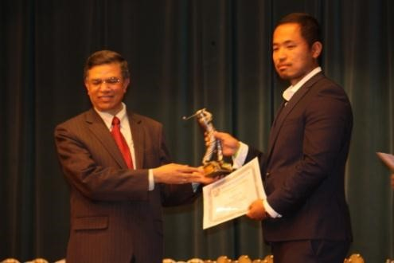
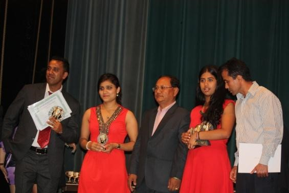
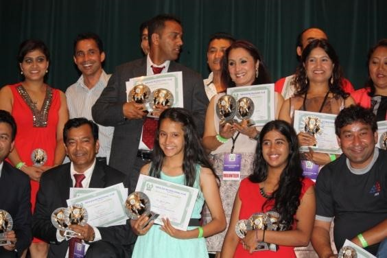
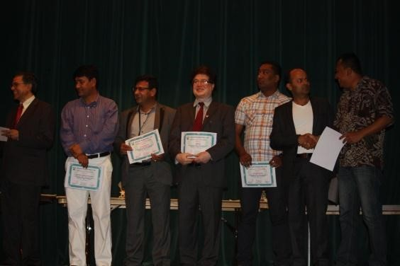

##### Official Desk
Miss Savi Hamal and Miss June Shrestha professionally managed the pressure of
official desk. The duties involved record keeping of the scores and announcing of the results. NRC
also received help from partners of players visiting from other states and from within NSW. NRC was
well supported from behind the scene by NRC Executives Mrs Anju Shrestha, Mr Mohan Neupane,
Mr Subarna Sharma, Mr Shree Napit and supporters Mr Sunil & Mrs Preeti Sharma, Mrs Meena
Sharma, Mrs Sapna Hamal, Mrs Praticha Pandey and Mrs Babita Shrestha are just few among the
many volunteers.

##### Award/Dinner Night
The interstate tournament concluded on Sunday 29 December 2013 at
Petersham Town Hall with the award ceremony and dinner night. It was attended by players,
Sponsors, volunteers, community leaders, media along with Ambassador of Nepal to Australia H.E.
Rudra Kumar Nepal and Honorary Consul General (NSW) Mr Deepak Khadka. Program was MC by
Mrs Sanita Pradhan and Mr Kishor Acharya whereas Cultural show was conducted by Mr Bhupendra
Chudal.

NRC was well supported by Nepalese Association of Victoria (NAV), Nepalese Association of
Queensland (NAQ), Australian Nepalese Friendship Society (ANFS), Nepalese Association of Northern
Territory and Embassy of Nepal.

NRC is in debt to Mr Madhu Sudan Pokhrel and Mr Jog Limbu (VIC), Mr Hari Khadka and Mr
Abhimanyu KC (QLD), and Mr DD Kandel (ACT) for their valuable contribution in formulation of the
tournament from its conception in early August 2013.

NRC would like to gratitude all players, sponsors, supporters, media partners, community leaders
and family members for their efforts to successfully accomplish this historic event.

**Where from here now**

With the talk held among all State coordinators it was decided to organise the next Interstate
tournament in around December 2014/January 2015 in Melbourne lead by Nepalese Association of
Victoria and supported by other state sporting CBO’s.

