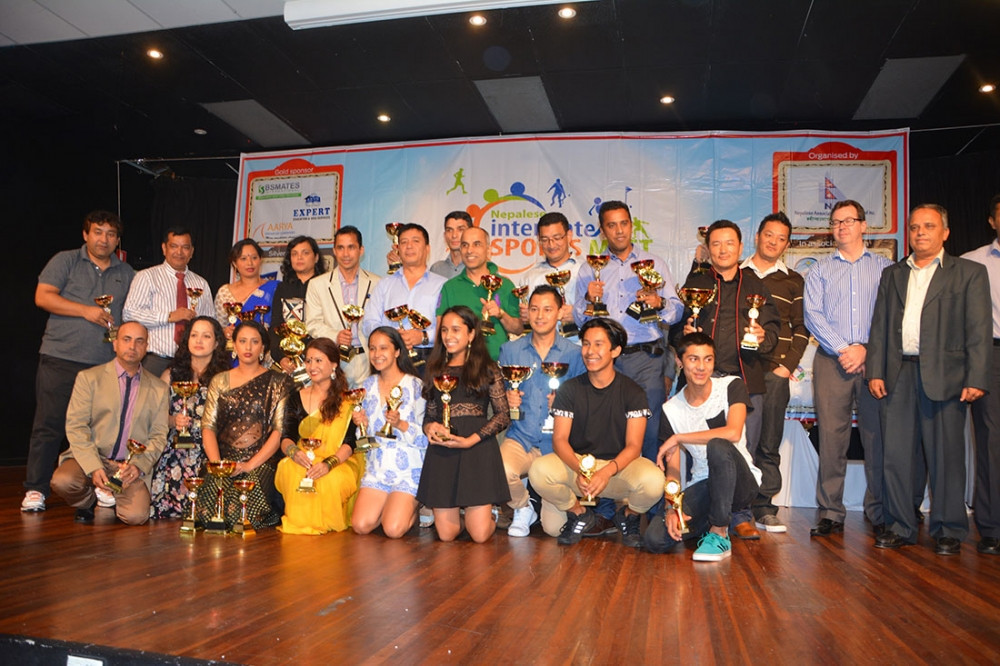

+++
title = "3rd NISM 2016"
date = 2016-12-31
+++

The third Nepalese Interstate Sports Meet was recently held in Brisbane from the 25th to the 27th of March 2016. Three hundred and sixty five (365) players of Nepalese origin from New Zealand and all the states and territories in Australia except Tasmania  participated in various sporting competitions including soccer, cricket, tennis, table tennis, badminton, golf and 5 km run. In addition to these sports, a friendly volleyball competition among the three local teams involving the participation of 21 players was also held. A summary of the results of all the games is attached here with.

The quality and competitiveness of the majority of players were witnessed by everyone participating/attending the event. Since its inception in 2013, the sports meet has always been, without any doubt, the biggest Nepalese sporting event in Australia, and the event has been quite successful in its objectives of developing a strong bond among the communities through sport, acknowledging the great sporting talents we have got in our communities and promoting various sports for health benefits.

We would like to congratulate all the winners of various sports under a number of categories. We feel really sorry for those who couldn't make it to the top despite their great efforts. Sincere thanks to all the participants for your hard work and wonderful efforts. We hope to see much more of your sporting talent in the coming years.

We, on behalf of the organizers, would like to thank all the players who travelled all the way from their home cities to Brisbane to participate in the event. The financial support from NRNA Australia, Nepalese Embassy in Canberra, Nepalese Recreation Club - Sydney, Nepalese Association of Victoria and Australia - Nepal Friendship Society of Canberra is greatly appreciated. We also extend our thanks  to the Nepalese communities and various sporting clubs who have supported the individual players and the participating teams.

We would like to thank all the volunteers who worked tirelessly during the entire event including the award presentation ceremony and gala dinner. Our appreciation goes to all the referees, who helped us  to run the competitions smoothly.  Hosting of this event has been a great challenge for us, both financially and logistically. This event would not have been possible without the selfless support of our generous sponsors. A big thank therefore goes to  Finance Concepts as an event partner and to all the sponsors of the event for their financial support and also to all the media partners who played a significant role in promoting this event.

Thanks to all who worked on the front and behind the scene in various roles and at various stages of the event to make it a grand success. Special thanks to the families who provided accommodation to the interstate participants. Thanks to all the guests who travelled all the way from Melbourne, Sydney, Canberra, Darwin, Adelaide, Perth and New Zealand to attend this event.

Our sincere thanks also goes to all the members of the local Nepalese communities in and around Brisbane for providing great encouragement to the players participating in the meet.

Last but not the least, our sincere thanks to all the members of the interstate co-ordination committee, members of the organizing committee, various sports co-ordinators, members of NAQ executive committee, members of NRNA Australia executive committee, Queensland State Co-ordination Committee and  NRNA NCC - NZ, for their highly committed contribution during various stages of the sport meet. Without these helps, the success of this event was not possible.

Organizing this event has been a learning curve for us. Despite putting our efforts, we experienced some lapses here and there. We will review them and come up with recommendations to further improve the next NISM event. We will be sending survey questionnaire to all of you and request your honest response so that we can compile these feed backs to guide our future NISM. 

We hope to continue organizing this kind of event in the future. For this, we would certainly need your support, encouragement, and commitment.

Thanks again for making the Nepalese Interstate Sports Meet 2016 a grand success.

##### **Related Links**
- <a href=".././.././doc/3rd-nism-2016-Results.pdf" target="_blank">Medal Tally & Detailed Results</a>
- <a href="https://ekantipur.com/diaspora/2016/03/29/20160329183657.html" target="_blank">Media Coverage - eKantipur</a>